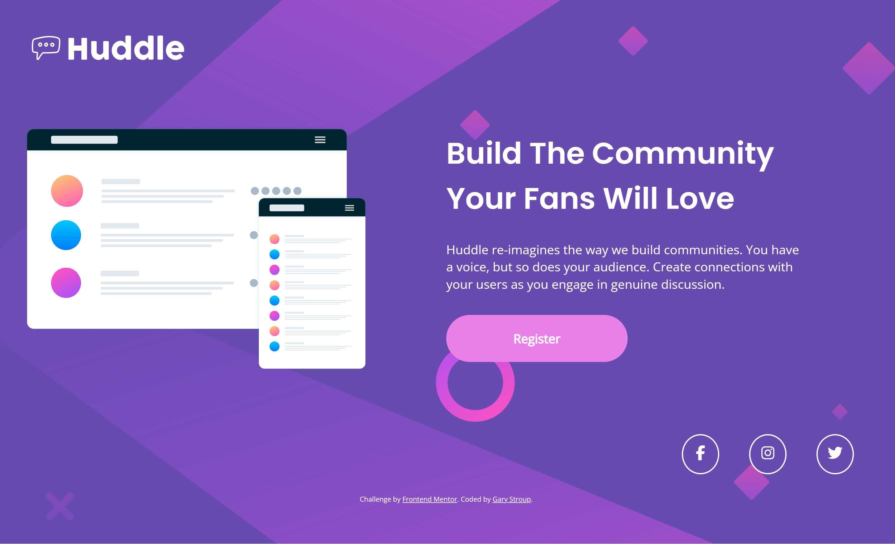

# Frontend Mentor - Huddle landing page with single introductory section solution

This is a solution to the [Huddle landing page with single introductory section challenge on Frontend Mentor](https://www.frontendmentor.io/challenges/huddle-landing-page-with-a-single-introductory-section-B_2Wvxgi0). Frontend Mentor challenges help you improve your coding skills by building realistic projects. 

## Table of contents

- [Overview](#overview)
  - [The challenge](#the-challenge)
  - [Screenshot](#screenshot)
  - [Links](#links)
- [My process](#my-process)
  - [Built with](#built-with)
  - [What I learned](#what-i-learned)
  - [Continued development](#continued-development)
  - [Useful resources](#useful-resources)
- [Author](#author)

## Overview

### The challenge

Users should be able to:

- View the optimal layout for the page depending on their device's screen size
- See hover states for all interactive elements on the page

### Screenshot




### Links

- Solution URL: [Add solution URL here](https://your-solution-url.com)
- Live Site URL: [Add live site URL here](https://your-live-site-url.com)

## My process

### Built with

- Semantic HTML5 markup
- CSS custom properties
- Flexbox
- CSS Flexbox
- Mobile-first workflow

### What I learned

When I looked at the design, I thought through what it is I need to accomplish with the layout at both mobile and desktop. I originally thought
that I could only apply padding to the main wrapper and things would be just fine, but the mobile view was a bit off. So I opted for using display
flex. This allowed me to add in the necessary padding at the larger screen size. 

update: I noticed I did not set the width of the absolute image which created a horizontal scroll on small screens.
setting the width allowed for a better fit. Also, I did not use the mobile bg image but i did rotate the desktop version on mobile screens to give it a close enough look.

see code snippets, below:

```html
<div class="main-content__materialBox">
  <div class="hero box"></div>
  <div class="main-content__materialBox-hookline box">
    <p class="header">Build The Community Your Fans Will Love</p>
    <p class="content">
      Huddle re-imagines the way we build communities. You have a voice, but so does your audience.
      Create connections with your users as you engage in genuine discussion.
    </p>
    <div class="content btn">Register</div>
  </div> 
</div>
```
```css
:root {
    --Mobile: 375px;
    --Desktop: 1440px;

    --Violet: hsl(257, 40%, 49%);
    --SoftMagenta: hsl(300, 69%, 71%);
    --White: #FFF;
    --attribution:hsl(228, 45%, 44%);

    --ff-Heading: 'Poppins', sans-serif;
    --ff-Body: 'Open Sans', sans-serif;

    --fw-400: 400;
    --fw-600: 600;

    --fs-header-mobile: 1.5rem;
    --fs-header-desktop: 3rem;
    --fs-content: 1.5rem;

    --btn-padding-mobile: 1rem 2rem;
    --btn-padding-desktop: 1.5rem;
    --btn-width-mobile-min: 50%;
    --btn-width-mobile-max: 23.44rem;
    --btn-width-desktop: calc(90% - 10rem);
    
    --icons-social-dimensions: 1rem;
    --icon-margin: 1rem;  
}

.wrapper {
    display: flex;
    flex-direction: column;
    justify-content: center;
}

.wrapper, .main-content__materialBox-hookline {
    padding: 3rem 1rem;
}

.main-content {
    flex: 1;
}

.absolute {
    transform: rotateY(180deg);
    position: absolute;
    top: 0;
    left: 0;
    z-index: -5;
    height: auto;
    width: 100%;
}
```


### Continued development

I struggled a bit with managing the size of the illustration-mockup.svg image. This made transitioning from smaller screens to larger screens difficult. I am still
not sure how well I handled the background image with respect to how the design intended for it to look at different screens sizes. Overall, I am proud of what I was
able to accomplish today. 

Moving forward, continue with critically thinking about the best approach for the design. Keep practicing my flex and grid skills as well as improve my general css
knowledge.

### Useful resources

- Kevin Powell is my go to for CSS related content. 

## Author

- Website - [Gary Stroup](https://www.garystroupdeveloper.com/)
- Frontend Mentor - [@gary-stroup-developer](https://www.frontendmentor.io/profile/gary-stroup-developer)
- Twitter - [@yourusername](https://www.twitter.com/yourusername)


